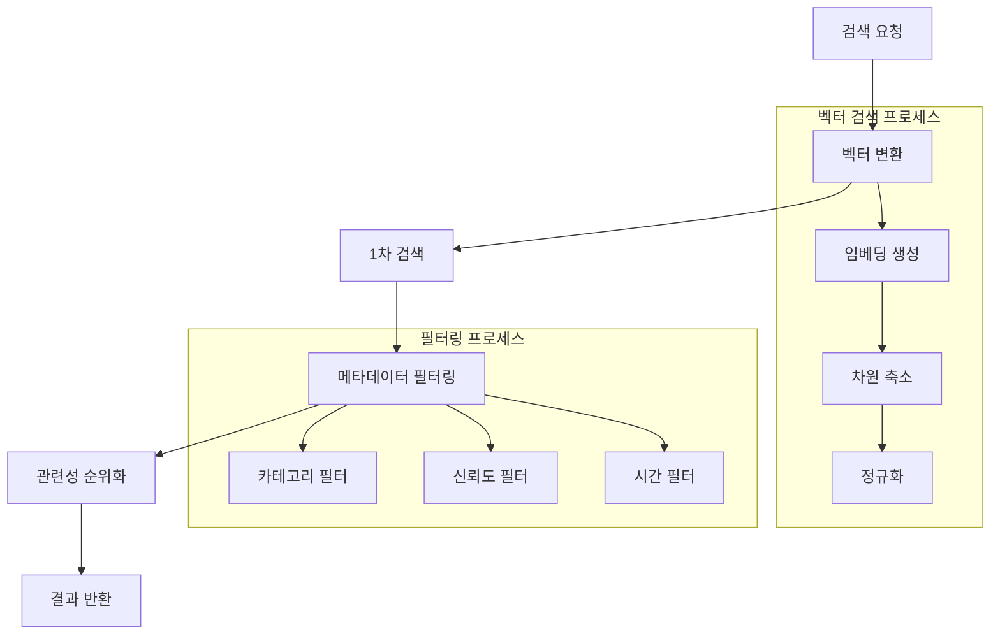

# JERRY 시스템 문서 (2025-01-05)

## 프로젝트 개요
JERRY는 건강검진 데이터 기반의 지능형 영양제 추천 시스템입니다. 벡터 데이터베이스와 RAG(Retrieval-Augmented Generation) 기술을 활용하여 개인화된 영양제 추천과 건강 상담을 제공합니다.

## 시스템 구조
```
📁 jerry_project/
├── 📁 config/
│   ├── config.yaml              # 시스템 설정
│   └── config_loader.py         # 설정 로더
│
├── 📁 core/
│   ├── 📁 vector_db/           # 벡터 DB 관련
│   │   ├── vector_store_manager.py  # 벡터 DB 생성/관리
│   │   └── embedding_creator.py     # 임베딩 생성
│   │
│   ├── 📁 services/            # 핵심 서비스
│   │   ├── rag_service.py          # RAG 기반 검색/생성
│   │   ├── health_service.py       # 건강 서비스
│   │   └── interaction_service.py   # 상호작용 분석
│   │
│   └── 📁 analysis/            # 분석 모듈
│       └── health_analyzer.py   # 건강 데이터 분석
│
├── 📁 api/                      # API 엔드포인트
│   └── routes/
│       ├── health.py           # 건강 관련 API
│       ├── supplements.py      # 영양제 관련 API
│       └── interactions.py     # 상호작용 API
│
├── 📁 models/                   # 데이터 모델
│   ├── health_data.py          # 건강 데이터 모델
│   └── supplement.py           # 영양제 관련 모델
│
├── 📁 utils/                    # 유틸리티
│   ├── openai_client.py        # OpenAI API 클라이언트
│   └── logger_config.py        # 로깅 설정
│
└── 📁 external/                 # 외부 연동
    └── pubmed_client.py        # PubMed API 클라이언트
```

## 벡터 DB 구조

### 컬렉션 구조
```python
collections = {
    "supplements": {
        # 영양제 정보 컬렉션
        "embeddings": List[float],  # 1536차원 벡터
        "metadata": {
            "name": str,            # 영양제 이름
            "category": str,        # 분류
            "effects": List[str],   # 효과
            "evidence_level": str,  # 근거 수준
            "timestamp": str,       # 생성/수정 시간
            "source": str          # 데이터 출처
        }
    },
    
    "interactions": {
        # 상호작용 정보 컬렉션
        "embeddings": List[float],
        "metadata": {
            "supplements": List[str],  # 관련 영양제들
            "effect_type": str,       # 상호작용 유형
            "severity": str,          # 심각도
            "mechanism": str,         # 작용 기전
            "evidence": List[str]     # 근거 출처
        }
    },
    
    "health_data": {
        # 건강 데이터 컬렉션
        "embeddings": List[float],
        "metadata": {
            "category": str,         # 건강 카테고리
            "metrics": List[str],    # 관련 지표
            "normal_range": str,     # 정상 범위
            "risk_factors": List[str] # 위험 요인
        }
    }
}
```

### 검색 프로세스


## API 엔드포인트

### 건강 분석 API
- `POST /api/health/analyze`: 건강 데이터 분석
- `GET /api/health/categories`: 건강 카테고리 조회
- `GET /api/health/metrics`: 건강 지표 조회

### 영양제 API
- `GET /api/supplements`: 영양제 목록 조회
- `GET /api/supplements/{id}`: 영양제 상세 정보
- `POST /api/supplements/recommend`: 영양제 추천

### 상호작용 API
- `POST /api/interactions/analyze`: 상호작용 분석
- `GET /api/interactions/{id}`: 상호작용 상세 정보

## 업데이트 내역

### 2025년
- 2025-01-05
  - API 엔드포인트 구조화
  - 상호작용 분석 기능 개선
  - 문서 시스템 통합
- 2025-01-02
  - 시스템 구조 최적화
  - 서비스 통합
  - 유틸리티 통합

### 2024년
- 2024-12-31: 기본 시스템 구축
- 2024-12-30: 의학 데이터 시스템
- 2024-12-29: 벡터 DB 시스템