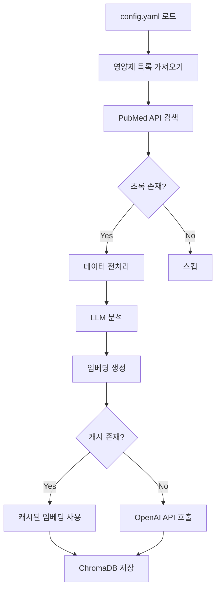

# JERRY 프로젝트 임베딩 시스템 기술 문서

## 1. 개요

JERRY 프로젝트의 임베딩 시스템은 영양제 관련 논문 데이터를 벡터화하여 ChromaDB에 저장하고 검색하는 기능을 제공합니다.

## 2. 시스템 구조

### 2.1 파일 구조
```
1_SRC/
├── core/
│   ├── vector_db/
│   │   ├── vector_store_manager.py   # ChromaDB 관리
│   │   ├── embedding_creator.py      # 임베딩 생성
│   │   └── __init__.py
│   └── data_source/
│       ├── data_source_manager.py    # PubMed 데이터 수집
│       └── __init__.py
├── utils/
│   ├── openai_client.py             # OpenAI API 클라이언트
│   ├── logger_config.py             # 로깅 설정
│   └── __init__.py
├── config/
│   ├── config.yaml                  # 기본 설정
│   └── health_mapping.yaml          # 건강 데이터 매핑
└── models/
    ├── health_data.py              # 건강 데이터 모델
    ├── interaction.py              # 상호작용 모델
    └── supplement.py               # 영양제 모델
```

### 2.2 임베딩 프로세스 순서도


### 2.3 주요 컴포넌트

- **ChromaManager**: ChromaDB 연결 및 컬렉션 관리
- **EmbeddingCreator**: OpenAI API를 사용한 임베딩 생성
- **DataSourceManager**: PubMed API를 통한 논문 데이터 수집
- **OpenAIClient**: OpenAI API 연동 및 임베딩 생성

### 2.4 API 응답 예시

#### PubMed API 응답
```json
{
    "pmid": "39751483",
    "title": "Basic Science and Pathogenesis",
    "abstract": "...",
    "authors": ["Lazarus SS", "..."],
    "journal": "Alzheimers Dement",
    "publication_date": "2024 Dec"
}
```

#### LLM 분석 결과
```json
{
    "key_findings": "...",
    "supplement_effects": "...",
    "safety_considerations": "...",
    "clinical_significance": "...",
    "authors_formatted": "...",
    "categories_formatted": "..."
}
```

#### ChromaDB 저장 형식
```json
{
    "ids": ["paper_39751483"],
    "embeddings": [[0.123, ...]],
    "metadatas": [{
        "pmid": "39751483",
        "title": "...",
        "abstract": "...",
        "authors": "...",
        "journal": "...",
        "publication_date": "...",
        "llm_analysis": "..."
    }]
}
```

### 2.2 컬렉션 구조

ChromaDB에는 다음과 같은 컬렉션들이 존재합니다:

1. **supplements**: 영양제 기본 정보
   - 메타데이터: type, name, category, analysis_method, analysis_time, confidence
2. **interactions**: 영양제 간 상호작용
   - 메타데이터: type, supplements, interaction_type, severity
3. **health_data**: 건강 관련 데이터
   - 메타데이터: type, category, keywords, source
4. **health_metrics**: 건강 지표
   - 메타데이터: type, metric_name, category, related_factors
5. **medical_terms**: 의학 용어 사전
   - 메타데이터: type, term_ko, term_en, category

## 3. 임베딩 프로세스

### 3.1 데이터 수집
1. `config.yaml`에서 영양제 목록 로드
2. PubMed API를 통해 각 영양제 관련 논문 검색
3. 논문 메타데이터 및 초록 수집

### 3.2 데이터 전처리
1. 논문 데이터 유효성 검증
   - 제목 존재 여부
   - 초록 길이 검증
   - 저자 정보 확인
2. 저자, 제목, 초록 등 필요 정보 추출
3. LLM을 통한 논문 내용 분석
   - key_findings
   - supplement_effects
   - safety_considerations
   - clinical_significance

### 3.3 임베딩 생성
1. OpenAI API를 사용하여 텍스트 임베딩 생성
   - 텍스트 정규화
   - API 호출 최적화
   - 에러 처리
2. 임베딩 벡터 정규화 및 검증
3. ChromaDB에 데이터 저장

## 4. 주요 기능

### 4.1 데이터베이스 초기화
```python
async def reinitialize_database(self, force: bool = False)
```
- 기존 컬렉션 삭제
- 새 컬렉션 생성
- 초기 데이터 임베딩

### 4.2 데이터 추가
```python
async def _add_paper_to_collection(self, collection_name: str, paper: Dict) -> bool
```
- 논문 데이터 임베딩 생성
- 메타데이터 구성
- ChromaDB에 저장

### 4.3 임베딩 생성
```python
def __call__(self, input: str | List[str]) -> List[List[float]]
```
- 텍스트 임베딩 생성
- 캐시 관리
- 에러 처리

## 5. 에러 처리

- 초록이 없는 논문 스킵
- 임베딩 생성 실패 시 로깅
- API 연결 오류 처리
- 데이터 유효성 검증 실패 처리

### 5.1 임베딩 생성 에러 처리
```python
try:
    embedding = self.client.create_embedding(text)
except Exception as e:
    logger.error(f"임베딩 생성 실패: {str(e)}")
    return [[0.0] * 1536] * len(texts)
```

## 6. 모니터링

### 6.1 로깅
- 상세한 프로세스 로깅
- 에러 및 경고 메시지
- 성능 메트릭스

### 6.2 상태 확인
```bash
python vector_store_manager.py --action stats --debug
```
- 컬렉션별 문서 수
- 메타데이터 필드 확인
- 임베딩 상태 점검

### 6.3 캐시 모니터링
```python
def get_cache_stats(self) -> dict:
    return {
        "cache_size": len(self._cache),
        "cache_hits": self.cache_hits,
        "cache_misses": self.cache_misses
    }
```

## 7. 설정

### 7.1 환경 변수
- OPENAI_API_KEY: OpenAI API 인증
- PUBMED_API_KEY: PubMed API 인증
- PYTHONPATH: 프로젝트 경로 설정

### 7.2 설정 파일
- config.yaml: 기본 설정
  - ChromaDB 연결 정보
  - OpenAI 모델 설정
  - 영양제 목록
- health_mapping.yaml: 건강 데이터 매핑

## 8. 성능 고려사항

### 8.1 임베딩 생성
- 배치 처리로 API 호출 최적화
- 임베딩 캐싱으로 중복 방지
  - 메모리 기반 캐시
  - 캐시 히트율 모니터링
- 병렬 처리 지원

### 8.2 데이터베이스
- 벡터 인덱싱 최적화
- 메모리 사용량 관리
- 쿼리 성능 최적화

## 9. 향후 개선사항

### 9.1 성능 개선
- 분산 처리 지원
- 영구 캐시 저장소
- 배치 크기 최적화

### 9.2 기능 개선
- 실시간 업데이트 지원
- 증분 업데이트
- 벡터 검색 최적화
``` 