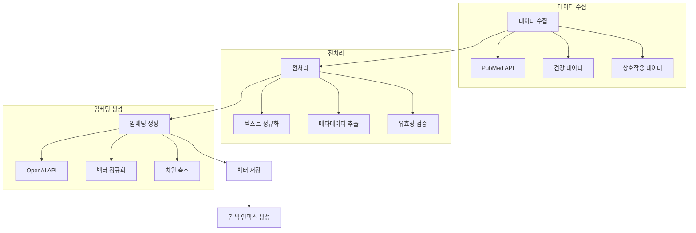

# JERRY 프로젝트 임베딩 시스템 기술 문서

## 1. 개요

JERRY 프로젝트의 임베딩 시스템은 영양제 관련 논문 데이터를 벡터화하여 ChromaDB에 저장하고 검색하는 기능을 제공합니다. OpenAI의 임베딩 모델을 사용하여 고품질의 벡터 표현을 생성하고, 이를 기반으로 효율적인 유사도 검색을 수행합니다.

## 2. 시스템 구조

### 2.1 파일 구조
```
1_SRC/
├── core/
│   ├── vector_db/
│   │   ├── vector_store_manager.py   # ChromaDB 관리
│   │   └── embedding_creator.py      # 임베딩 생성
│   └── services/
│       ├── health_service.py         # 건강 서비스
│       └── interaction_service.py     # 상호작용 분석
├── utils/
│   ├── openai_client.py             # OpenAI API 클라이언트
│   └── logger_config.py             # 로깅 설정
└── models/
    ├── health_data.py              # 건강 데이터 모델
    └── supplement.py               # 영양제 모델
```

### 2.2 임베딩 프로세스


## 3. 주요 컴포넌트

### 3.1 ChromaManager
```python
class ChromaManager:
    async def reinitialize_database(self, force: bool = False):
        """데이터베이스 재초기화"""
        # 사용자 확인
        if not force:
            confirmation = input("정말로 모든 데이터를 삭제하시겠습니까? (yes/no): ")
            if confirmation.lower() != 'yes':
                return False
            
            # 비밀번호 확인
            password = input("관리자 비밀번호를 입력하세요: ")
            if password != "ckrgkstmqrhks!23":
                return False

        # 컬렉션 초기화
        self.collections = await self._initialize_collections()
        await self.initialize_data()
        return True

    async def get_supplement_interaction(self, supp1: str, supp2: str) -> Dict:
        """영양제 상호작용 조회"""
        collection = self.client.get_collection("interactions")
        query = f"{supp1} AND {supp2} interaction"
        
        results = collection.query(
            query_texts=[query],
            n_results=1
        )
        
        return {
            "supplements": [supp1, supp2],
            "interaction_type": results['metadatas'][0].get('interaction_type'),
            "severity": results['metadatas'][0].get('severity'),
            "mechanism": results['documents'][0],
            "evidence": [{
                "source": "PubMed",
                "pmid": results['ids'][0],
                "summary": results['documents'][0]
            }]
        }

    async def get_health_impacts(self, supplement: str) -> List[Dict]:
        """건강 영향 조회"""
        collection = self.client.get_collection("health_data")
        query = f"{supplement} health effects"
        
        results = collection.query(
            query_texts=[query],
            n_results=3
        )
        
        return [{
            "supplement": supplement,
            "health_aspect": meta.get('category', 'general'),
            "impact": doc,
            "evidence": {
                "source": "PubMed",
                "pmid": id,
                "summary": doc
            }
        } for meta, doc, id in zip(
            results['metadatas'],
            results['documents'],
            results['ids']
        )]
```

### 3.2 EmbeddingCreator
```python
class EmbeddingCreator:
    def __init__(self, openai_client):
        self.client = openai_client
        self.cache = {}

    async def create_embedding(self, text: str) -> List[float]:
        """임베딩 생성"""
        if text in self.cache:
            return self.cache[text]

        response = await self.client.embeddings.create(
            model="text-embedding-ada-002",
            input=text
        )
        
        embedding = response.data[0].embedding
        self.cache[text] = embedding
        return embedding

    async def batch_create_embeddings(
        self,
        texts: List[str],
        batch_size: int = 100
    ) -> List[List[float]]:
        """배치 임베딩 생성"""
        embeddings = []
        for i in range(0, len(texts), batch_size):
            batch = texts[i:i + batch_size]
            batch_embeddings = await asyncio.gather(*[
                self.create_embedding(text)
                for text in batch
            ])
            embeddings.extend(batch_embeddings)
        return embeddings
```

## 4. 데이터 처리 프로세스

### 4.1 데이터 수집
1. PubMed API를 통한 논문 데이터 수집
2. 건강 데이터 수집 및 전처리
3. 상호작용 데이터 수집 및 검증

### 4.2 임베딩 생성
1. 텍스트 정규화
2. OpenAI API를 통한 임베딩 생성
3. 벡터 정규화 및 저장

### 4.3 검색 최적화
1. 인덱스 생성
2. 메타데이터 필터링
3. 결과 순위화

## 5. 에러 처리

### 5.1 데이터 검증
```python
def validate_data(data: Dict) -> bool:
    """데이터 유효성 검증"""
    required_fields = ['title', 'abstract', 'authors']
    return all(field in data for field in required_fields)
```

### 5.2 API 오류 처리
```python
async def safe_api_call(func, *args, **kwargs):
    """안전한 API 호출"""
    try:
        return await func(*args, **kwargs)
    except Exception as e:
        logger.error(f"API 호출 실패: {str(e)}")
        return None
```

## 6. 성능 모니터링

### 6.1 지표
- 임베딩 생성 시간
- 검색 응답 시간
- 메모리 사용량
- API 호출 횟수

### 6.2 로깅
```python
logger.info("임베딩 생성 시작")
logger.debug(f"처리 데이터: {len(texts)}개")
logger.error(f"API 오류: {str(e)}")
``` 