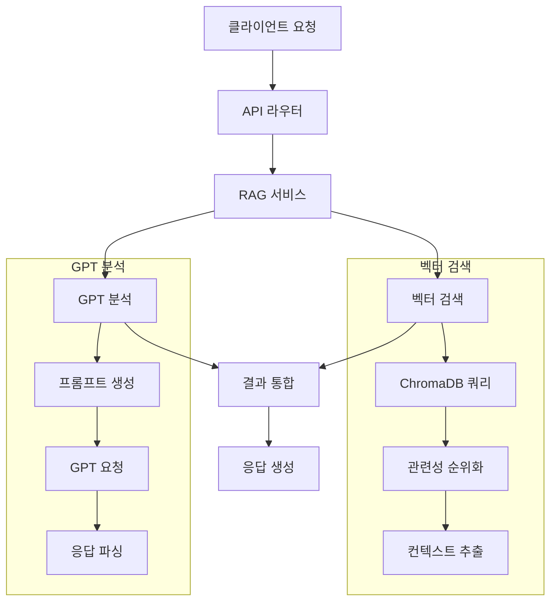

# JERRY 프로젝트 RAG-Middleware 문서

## 1. 개요

JERRY 프로젝트의 RAG-Middleware는 건강검진 데이터를 기반으로 개인화된 영양제 추천을 제공하는 시스템의 중간 계층입니다. 벡터 데이터베이스와 OpenAI의 GPT 모델을 활용하여 정확하고 신뢰성 있는 건강 상담과 영양제 추천을 제공합니다.

## 2. 시스템 구조

### 2.1 파일 구조
```bash
1_SRC/
├── api/
│   └── routes/
│       ├── health.py           # 건강 관련 API
│       ├── supplements.py      # 영양제 관련 API
│       └── interactions.py     # 상호작용 API
├── core/
│   ├── services/
│   │   ├── rag_service.py     # RAG 기반 서비스
│   │   ├── health_service.py  # 건강 서비스
│   │   └── interaction_service.py # 상호작용 분석
│   └── analysis/
│       └── health_analyzer.py  # 건강 데이터 분석
└── models/
    ├── health_data.py         # 건강 데이터 모델
    └── supplement.py          # 영양제 모델
```

### 2.2 데이터 흐름도


## 3. API 엔드포인트

### 3.1 건강 분석 API
```python
@router.post("/api/health/analyze")
async def analyze_health_data(
    data: HealthDataRequest,
    background_tasks: BackgroundTasks
) -> HealthAnalysisResponse:
    """건강 데이터 분석"""
    analysis = await health_service.analyze_health_data(data)
    background_tasks.add_task(health_service.store_analysis, analysis)
    return analysis

@router.get("/api/health/categories")
async def get_health_categories() -> List[HealthCategory]:
    """건강 카테고리 조회"""
    return await health_service.get_categories()
```

### 3.2 영양제 API
```python
@router.post("/api/supplements/recommend")
async def recommend_supplements(
    data: SupplementRequest
) -> SupplementRecommendation:
    """영양제 추천"""
    return await supplement_service.get_recommendations(data)

@router.get("/api/supplements/{id}")
async def get_supplement_details(
    id: str
) -> SupplementDetails:
    """영양제 상세 정보"""
    return await supplement_service.get_details(id)
```

### 3.3 상호작용 API
```python
@router.post("/api/interactions/analyze")
async def analyze_interactions(
    data: InteractionRequest
) -> InteractionAnalysis:
    """상호작용 분석"""
    return await interaction_service.analyze_interactions(data)
```

## 4. 서비스 구현

### 4.1 RAG 서비스
```python
class RAGService:
    def __init__(self, chroma_manager: ChromaManager, openai_client: OpenAIClient):
        self.chroma = chroma_manager
        self.openai = openai_client

    async def query_and_generate(
        self,
        query: str,
        context_type: str,
        max_results: int = 3
    ) -> Dict:
        """컨텍스트 기반 응답 생성"""
        # 1. 벡터 검색
        results = await self.chroma.query(
            collection=context_type,
            query=query,
            n_results=max_results
        )
        
        # 2. 컨텍스트 구성
        context = self._build_context(results)
        
        # 3. GPT 응답 생성
        response = await self.openai.chat.completions.create(
            model="gpt-4-1106-preview",
            messages=[
                {"role": "system", "content": self._get_system_prompt(context_type)},
                {"role": "user", "content": f"Query: {query}\nContext: {context}"}
            ]
        )
        
        return {
            "answer": response.choices[0].message.content,
            "sources": self._extract_sources(results)
        }
```

### 4.2 건강 서비스
```python
class HealthService:
    def __init__(self, rag_service: RAGService):
        self.rag = rag_service

    async def analyze_health_data(self, data: HealthData) -> Dict:
        """건강 데이터 분석"""
        # 1. 데이터 검증
        self._validate_health_data(data)
        
        # 2. 위험 요소 분석
        risks = await self._analyze_health_risks(data)
        
        # 3. 영양제 추천
        recommendations = await self._get_supplement_recommendations(risks)
        
        # 4. 상호작용 검사
        interactions = await self._check_interactions(recommendations)
        
        return {
            "risks": risks,
            "recommendations": recommendations,
            "interactions": interactions
        }
```

### 4.3 상호작용 서비스
```python
class InteractionService:
    def __init__(self, chroma_manager: ChromaManager):
        self.chroma = chroma_manager

    async def analyze_interactions(
        self,
        supplements: List[str]
    ) -> List[Dict]:
        """영양제 상호작용 분석"""
        interactions = []
        for i, supp1 in enumerate(supplements):
            for supp2 in supplements[i+1:]:
                result = await self.chroma.get_supplement_interaction(
                    supp1=supp1,
                    supp2=supp2
                )
                if result:
                    interactions.append(result)
        return interactions
```

## 5. 데이터 모델

### 5.1 요청 모델
```python
class HealthDataRequest(BaseModel):
    user_id: str
    health_metrics: Dict[str, float]
    medical_history: List[str]
    current_supplements: List[str]

class SupplementRequest(BaseModel):
    health_analysis_id: str
    preferences: List[str]
    exclusions: List[str]

class InteractionRequest(BaseModel):
    analysis_ids: List[str]
    recommendations: List[str]
```

### 5.2 응답 모델
```python
class HealthAnalysisResponse(BaseModel):
    analysis_id: str
    risk_factors: List[Dict[str, Any]]
    recommendations: List[Dict[str, Any]]
    next_steps: List[str]

class SupplementRecommendation(BaseModel):
    supplements: List[Dict[str, Any]]
    evidence: List[Dict[str, Any]]
    warnings: List[str]

class InteractionAnalysis(BaseModel):
    interactions: List[Dict[str, Any]]
    severity_levels: List[str]
    recommendations: List[str]
```

## 6. 에러 처리

### 6.1 API 에러
```python
class APIError(Exception):
    def __init__(self, code: int, message: str):
        self.code = code
        self.message = message

@app.exception_handler(APIError)
async def api_error_handler(request: Request, exc: APIError):
    return JSONResponse(
        status_code=exc.code,
        content={"error": exc.message}
    )
```

### 6.2 데이터 검증
```python
def validate_health_data(data: HealthData) -> bool:
    """건강 데이터 유효성 검증"""
    required = ['height', 'weight', 'blood_pressure']
    return all(metric in data.health_metrics for metric in required)
```

## 7. 성능 모니터링

### 7.1 메트릭스
- API 응답 시간
- 벡터 검색 시간
- GPT 요청 시간
- 에러율

### 7.2 로깅
```python
logger.info(f"건강 분석 시작: {user_id}")
logger.debug(f"벡터 검색 결과: {len(results)}개")
logger.error(f"GPT 요청 실패: {str(e)}")
``` 